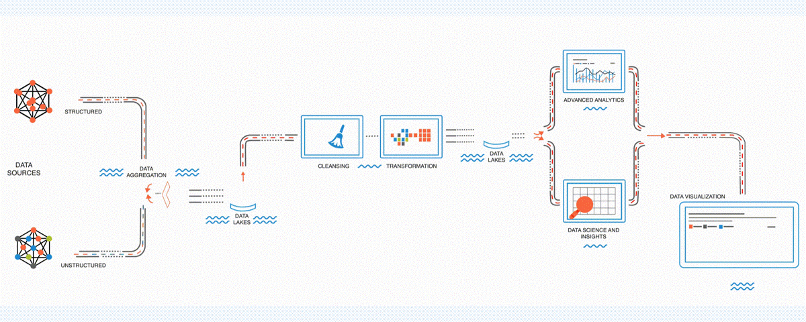

  

  

  

<!-- GIF Header -->

  

### Hi, I'm **Saurabh Chavan**  
I'm a graduate student in **Data Analytics Engineering** at **Northeastern University**, passionate about **data engineering and data analytics**.  

I work on **building scalable data solutions, optimizing workflows, and designing efficient ETL pipelines**.  

**Explore my repositories** to see projects on **Data Engineering, Machine Learning, BI dashboards, and Cloud-based ETL pipelines**.  

###  Featured Projects  

🔹 [Sales Data ETL & Analytics Pipeline (Azure)](https://github.com/saurabhchavan7/Sales-Data-End-to-End-Data-Engineering-Project-Using-Azure-Services)  
🔹 [Data Warehousing & ETL for Policy Lapsation](https://github.com/saurabhchavan7/Data-Warehousing-and-ETL-Implementation-for-Policy-Lapsation-in-Life-Insurance-Industry)  
🔹 [Vehicle Insurance Claim Management System](https://github.com/saurabhchavan7/Vehicle-Insurance-Claim-Management-System)  
🔹 [Distributed Kafka-Spark Pipeline](https://github.com/saurabhchavan7/Distributed-Kafka-Spark-Pipeline-for-High-Velocity-Data-Streams)  
🔹 [AWS SageMaker Flight Fare Predictor](https://github.com/saurabhchavan7/AWS-SageMaker-FlightFarePredictor)  
🔹 [Automated File Processing Pipeline (AWS & Snowflake)](https://github.com/saurabhchavan7/Automated-File-Processing-Pipeline-Using-AWS-and-Snowflake)  

---

### Skills & Tools  
#### **Programming Languages**  

#### **Cloud & Data Warehousing**  

#### **ETL, ELT & Data Pipelines**  

#### **Databases**  

#### **Tools & BI**  

### GitHub Stats  

  
  

  

---

### Connect with Me  

📧 **Email:** [chavan.sau@northeastern.edu](mailto:chavan.sau@northeastern.edu)  
🔗 **LinkedIn:** [linkedin.com/in/saurabhchavan](https://www.linkedin.com/in/saurabhchavan)  

---

